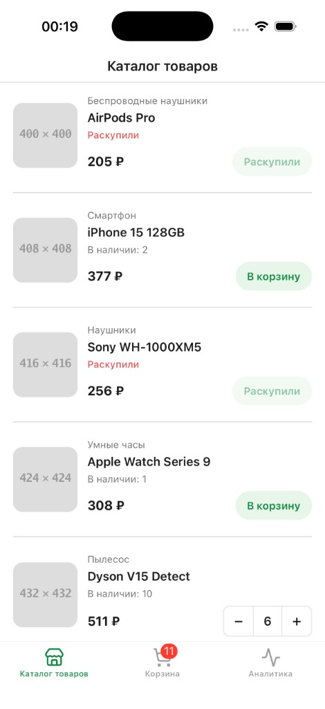
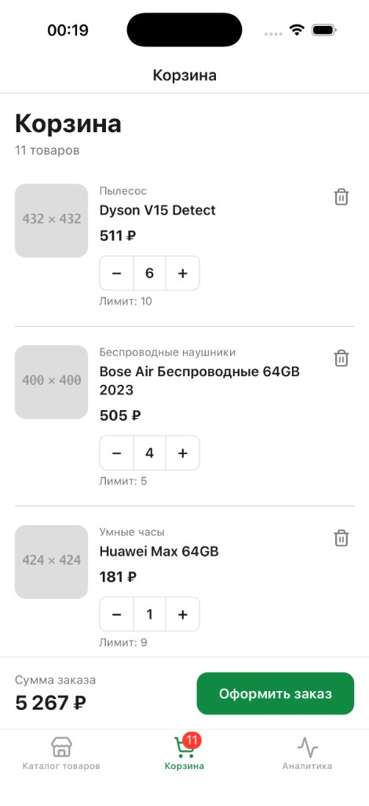
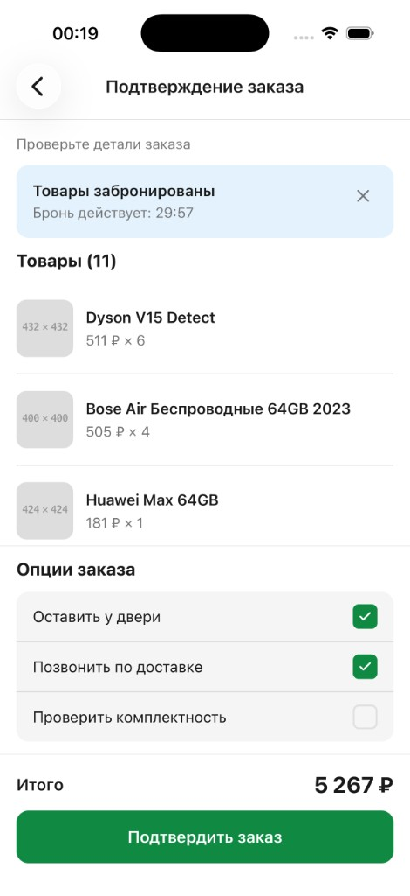
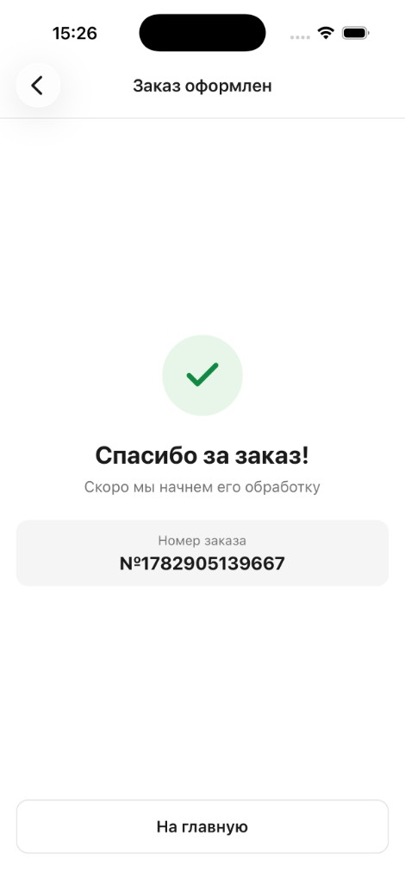
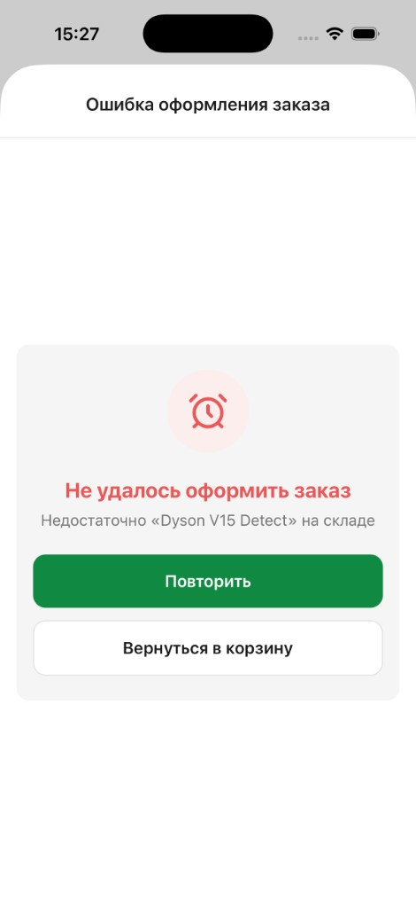

# PickCart

Тестовое React Native приложение — каталог товаров, корзина и оформление заказа с мок-бэкендом.

## Скриншоты

| Каталог | Корзина | Подтверждение |
|:---:|:---:|:---:|
|  |  |  |

| Успех | Ошибка |
|:---:|:---:|
|  |  |

## Функциональность

### Каталог
- 1000 товаров, подгрузка по 10 штук (`FlashList`)
- Pull-to-refresh, бесконечный скролл
- Добавление в корзину, изменение количества
- Отображение остатка, состояние «Раскупили» при `stock = 0`
- Лимит количества через единый реестр остатков `productStore.stockById`

### Корзина
- Список позиций, итоговая сумма, лимит по stock
- Бейдж на табе с количеством товаров
- Минимальная сумма заказа с бэка (1000–2000 ₽, случайно)
- Блокировка оформления, если корзина пуста или сумма ниже порога
- Персистентность корзины (`AsyncStorage`)
- Двухшаговое оформление: сначала бронирование (`reserve`), затем подтверждение
- Модалка ошибок бронирования (`CheckoutIssuesModal`): out of stock, урезание количества, смена мин. суммы
- Подсветка проблемных позиций после неуспешной брони
- Баннер активной брони с таймером и отменой
- Защита от изменения корзины при активной брони (Alert → снятие брони)

### Опции заказа
- 3 опции доставки (чекбоксы на экране подтверждения)
- Сохранение в `AsyncStorage`

### Оформление
- **Шаг 1 — бронирование** (`checkout`): проверка stock и мин. суммы, корректировка корзины
- **Шаг 2 — подтверждение**: товары, опции, итог, таймер брони (30 мин)
- **Шаг 3 — отправка** (`confirmOrder`): финальный запрос на бэкенд
- Успех → экран «Спасибо за заказ», очистка корзины и брони
- Ошибка confirm → `ErrorScreen`
- Истечение брони → alert и возврат в корзину

### Остатки (`stockById`)
- Единый `Map<productId, stock>` в `productStore`, персист в `AsyncStorage`
- Заполняется при загрузке каталога (`get` / `more` / `refresh`) и обновляется после бронирования
- UI и лимиты степпера читают stock только через `getStock(id)`

### Аналитика
- Типизированные события (`reportEvent<T>`)
- `CHECKOUT_STATE_CHANGED` через MobX `reaction` (debounce 300 ms)
- UI-событие: `CHECKOUT_TAPPED`
- События заказа: `ORDER_SUBMITTED` / `ORDER_CONFIRMED` / `ORDER_FAILED`
- Очередь отправки, мок с `SERVICE_UNAVAILABLE`

### Инициализация
- `appInitStore` — гидрация `orderStore` и `productStore`, загрузка мин. суммы заказа
- Экран загрузки до готовности, retry при ошибке init

## Стек

| Слой | Технологии |
|---|---|
| Framework | React Native 0.86, React 19 |
| Язык | TypeScript 5.8 |
| Стейт | MobX 6, mobx-react-lite, mobx-persist-store |
| Навигация | React Navigation 7 (tabs + native stack) |
| UI | react-native-unistyles, lucide-react-native |
| Списки | @shopify/flash-list |
| Паттерны | ts-pattern |
| Хранение | @react-native-async-storage/async-storage |
| Архитектура | Feature-Sliced Design (app / screens / widgets / entities / shared) |
| Качество | ESLint, Prettier, Husky pre-commit (`npm run validate`) |

## Структура

```
src/
  app/           — App, навигация, global reactions
  screens/       — экраны (каталог, корзина, подтверждение, успех, ошибки)
  widgets/       — TabBarNavigation
  entities/      — cart, order, product, analytics, app-init
  shared/        — api (product, order, checkout, analytics), ui, config, lib
```

## Запуск

```sh
npm install
npm start          # Metro
npm run ios        # или npm run android
npm run validate   # typecheck + lint
```

